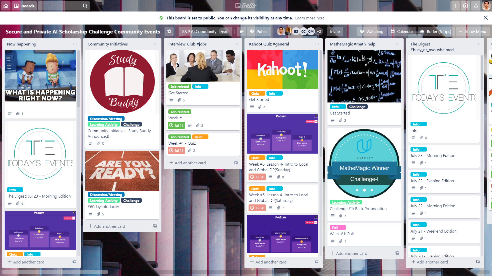

Phase 1 of the scholarship was pouring out with exciting community events like meetups, quizzes, discussions etc. To make sure fellow
scholars don't miss out on these wonderful activities I had maintained a *Trello* board on a daily basis over the course of the challenge.
Thanks Bharati Subramanian for the contributions.

See the Trello board [here](https://trello.com/b/0adjqXce/secure-and-private-ai-scholarship-challenge-community-events)

